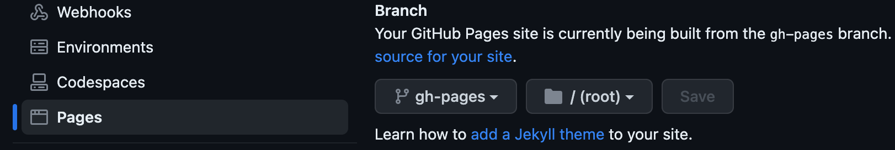

# html-trend-report-action

Publish html trend reports per branch (type: `node16`)

Implementation of Jenkins [Plot](https://plugins.jenkins.io/plot/) and [HTML Publisher](https://plugins.jenkins.io/htmlpublisher/).


See examples:

- [CSV based report](https://mgrybyk.github.io/html-trend-report-action/report-action/main/chart-report-2/)
- [HTML Report](https://mgrybyk.github.io/html-trend-report-action/report-action/main/html-report-1/5964862780_1692886305532/)
  [HTML Report history](https://mgrybyk.github.io/html-trend-report-action/report-action/main/html-report-1/)
- [Browser different branches](https://mgrybyk.github.io/html-trend-report-action/)
- [Pull Request Comment Example](todo)

*Compatible with [allure-report-branch-action](https://github.com/marketplace/actions/allure-report-with-history-per-branch). See [Allure History List](https://mgrybyk.github.io/html-trend-report-action/allure-action/main/self-test/)*

## Usage

1. Enable Pages in your repository settings.


2. In your workflow yaml
```yaml
TODO
```

### Adding PR Comment

```yaml
TODO
```

### Examples Repos

TODO

## API

Please see [action.yml](./action.yml)

## Troubleshooting

### Issues on push to gh-pages

Log `! [rejected]        HEAD -> gh-pages (non-fast-forward)`

Do not run your workflow concurrently per PR or branch!
```yaml
# Allow only one job per PR or branch
concurrency:
  group: ${{ github.workflow }}-${{ github.head_ref || github.ref }}
  cancel-in-progress: true # true to cancel jobs in progress, set to false otherwise
```

## Credits

- [thollander/actions-comment-pull-request](https://github.com/thollander/actions-comment-pull-request) for building Github Action that comments the linked PRs

## Upcoming features

- cleanup old reports
